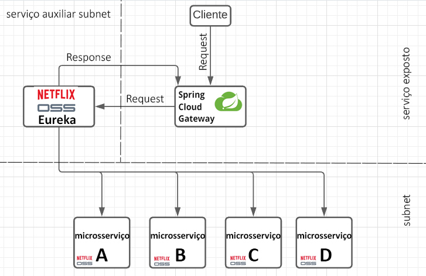

# Microsserviço Discovery Service.

#### Este microsserviço segue o padrão de implementação do Spring Cloud Eureka.
- Este Microserviço é um servidor do Netflix Eureka, todo os microsserviços que nascerem neste ambiente devem se conectar a ele, se tornando assim Eureka Clients.

### Objetivo:
- Descobrir os endereços dinamicros de microsserviços criados em um ambiente de microsserviços. 

### Fluxograma de Microsserviços: 

### Pré-requisitos
* JDK 16
