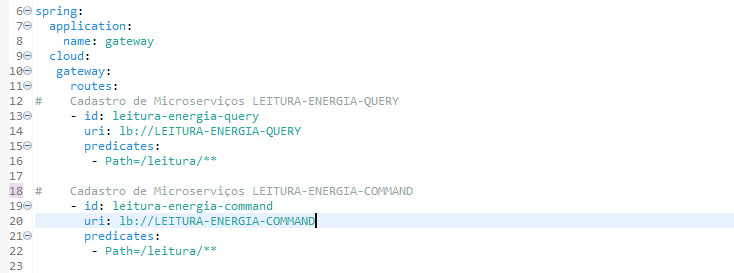
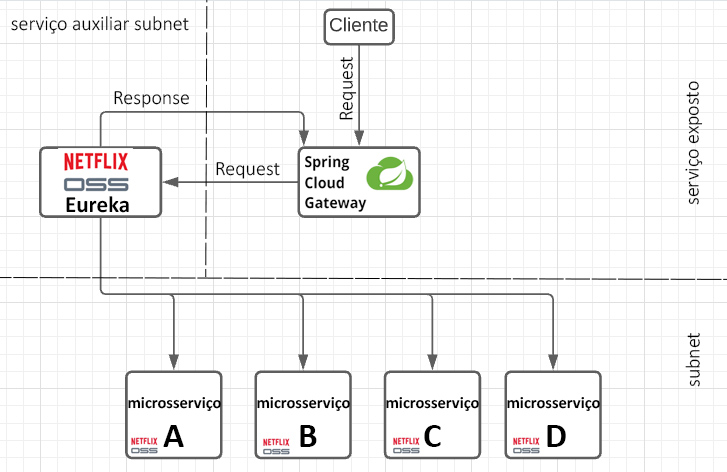

# Microsserviço GATEWAY.

#### Este microsserviço segue o padrão de implementação do Spring Cloud Gateway

### Objetivo:
Receber requisições de fora ou de dentro da rede e descobrir a melhor instancia pra processar tal requisição usando a descoberta de serviços do Netflix Eureka.

### Exemplo de Configuração: 

- Em "id:" especifique o nome do microsserviço com letra minúscula. Em “uri:” Especifique: “lb://” para verificar no loadbalance do Eureka em seguida o nome da sua aplicação.  

### Fluxograma de Microsserviços: 

### Pré-requisitos
* JDK 11

